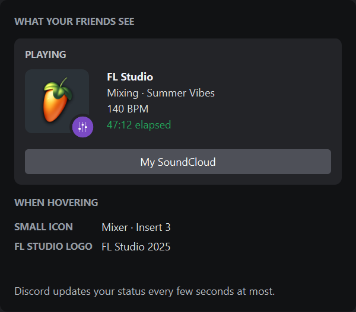
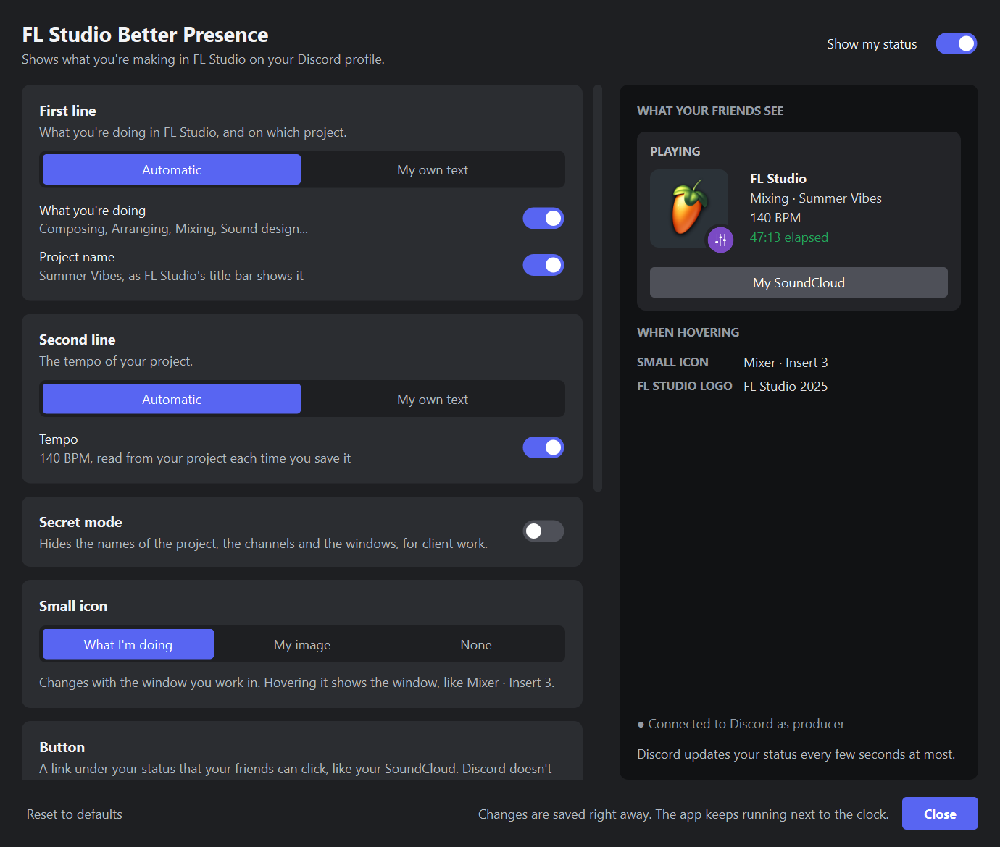
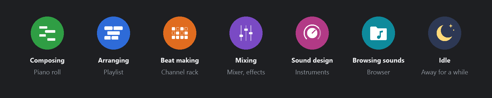

# FL Studio Better Presence

Discord Rich Presence for FL Studio. Shows what you're making in FL Studio in your Discord status: what you're doing
(composing, arranging, mixing…), the project, its tempo and how long you've been working on it.

<p align="center">
  
  <br>
  <em>Your status, as the settings window previews it.</em>
</p>

Nothing to install in FL Studio: no script, no MIDI device. The app runs next to the clock and reads FL Studio's
windows from the outside, the way Windows shows them.

## Features

- **What you're doing**, from the FL Studio window you work in: Composing in the Piano roll, Arranging in the
  Playlist, Beat making in the Channel rack, Mixing in the Mixer and its effects, Sound design in an instrument,
  Browsing sounds in the Browser.
- **Small icon** on the FL Studio logo for each of them, with the window on hover, like "Mixer · Insert 3" or "808 Kick · Insert 1".
- **Project name**, as FL Studio's title bar shows it: the file's name, or the title typed in Project info.
- **Tempo** of the project, read from the `.flp` file each time you save it.
- **Secret mode** for client work: hides the names of the project, the channels and the windows.
- **Your own text** for each line, with placeholders.
- **Idle detection**: shows "Idle" or hides your status, and neither the time away nor the time the computer sleeps is counted.
- **Button** with a link, to your SoundCloud for example.
- **Settings window** with a live preview of what your friends see, where every change applies right away.
- **Starts with Windows**: your status appears when FL Studio opens and goes away when it closes.

## Requirements

- Windows 10 or 11
- FL Studio. Made with FL Studio 2025; older versions should work but haven't been tested yet.
- The **Discord desktop app**, running. Discord in a web browser doesn't work.

## Installing

1. Download `FL-Studio-Better-Presence.exe` from the [latest release](https://github.com/TheUnknownMurda/FL-Studio-Better-Presence/releases/latest).
2. Move it to a folder where it can stay, like `Documents`: Windows starts it from there when you sign in.
3. Double-click it. Windows may show **Windows protected your PC**, because the app isn't signed:
   click **More info**, then **Run anyway**.
4. The settings window opens. You can close it: the app keeps running next to the clock.

Your status shows up in Discord as soon as FL Studio is open.

## Updating

Start the new `FL-Studio-Better-Presence.exe`: it replaces the version that runs, keeps your settings, and is the
one Windows starts from then on. To put it where the old one was, quit the app first (right-click its icon, then
**Quit**): Windows doesn't let the file of a running app be replaced.

## Using it

The app's icon is next to the clock. Windows may hide it under the **^** arrow: drag it to the taskbar to keep it in sight.

- **Click** it to open the settings.
- **Right-click** it for **Show my status**, **Secret mode**, **Settings…** and **Quit**.
- Its dot tells what Discord shows: **blue** for your status, **grey** when FL Studio is closed or your status is hidden,
  **yellow** when the Discord app isn't open or refused the status.

## Settings

The window shows what your friends see, updated live from FL Studio, and every change is saved right away.
While FL Studio is closed, it shows an example.

<p align="center">
  
</p>

| Setting | What it does |
|---|---|
| **Show my status** | Shows or hides your status in Discord. Also in the icon's menu. |
| **First line** | Automatic: what you're doing and the project name, each with its switch. Or your own text. |
| **Second line** | Automatic: the tempo of the project. Or your own text. |
| **Secret mode** | Hides the names of the project, the channels and the windows. Also in the icon's menu. |
| **Small icon** | The small round icon on the FL Studio logo: what you're doing, your own image (a link to a PNG or JPG, with a text shown on hover), or none. |
| **Button** | Adds a button with a link. Your friends see it, but Discord doesn't show it to you. |
| **When you're away** | After the chosen time without using FL Studio: shows "Idle", hides your status, or does nothing. The timer pauses. |
| **Timer** | Restarts the timer when you open another project. |
| **Start with Windows** | Starts the app quietly when you sign in to Windows. |

In your own text, the **Task**, **Project**, **BPM** and **Version** buttons insert these placeholders:

| Placeholder | Replaced by |
|---|---|
| `{task}` | what you're doing, like "Composing" ("Idle" while idle) |
| `{project}` | the project name, empty in secret mode |
| `{bpm}` | the tempo of the saved project, like "140 BPM" |
| `{version}` | FL Studio's version, like "2025" |

Example: `{task} on {project}` shows "Composing on Summer Vibes". A placeholder with nothing to show takes the
separator next to it away: `{task} · {project}` shows "Composing" in secret mode.

### Small icons

<p align="center">
  
</p>

## What the app reads

- The titles of FL Studio's windows, which Windows shows to every app: the project name, and the window you work in.
- The start of your saved `.flp` file, for its tempo. The app finds it in FL Studio's list of recent projects.
- Whether you use the keyboard or the mouse in FL Studio, or in the plugins it runs apart (`ilbridge.exe`), to tell
  when you're away.

The app only talks to the Discord app on your computer, which shows your status to your friends. Discord downloads
the icons from this GitHub repository.

## Uninstalling

1. In the settings, turn off **Start with Windows**.
2. Right-click the app's icon, then **Quit**.
3. Delete `FL-Studio-Better-Presence.exe`, and the settings folder: type `%APPDATA%\FL Studio Better Presence`
   in the File Explorer address bar.

## Troubleshooting

| Problem | Solution |
|---|---|
| My status doesn't show up | Open the Discord desktop app. In Discord, make sure sharing your activity is turned on in **User Settings > Activity Privacy**. |
| The tempo doesn't show | Save the project: the tempo is read from the saved file. |
| It says "Making music" | Click in one of FL Studio's windows: the Piano roll, the Playlist... The Mixer counts once you click a mixer track. |
| "Windows protected your PC" | Click **More info**, then **Run anyway**. |
| I can't find the icon | Click the **^** arrow next to the clock. |
| A placeholder is shown as is, like `{task]` | Check the spelling and the braces: `{task}`. |

The app keeps a short log in `%APPDATA%\FL Studio Better Presence\log.txt`: attach it when you
[report a problem](https://github.com/TheUnknownMurda/FL-Studio-Better-Presence/issues).

## For developers

- `src/flbp/`: the app. `fl_watcher.py` reads FL Studio's windows, `flp.py` the tempo, `presence.py` builds the status,
  `discord_ipc.py` talks to the Discord app, `engine.py` ties them together every second, `app.py` and `ui/` are the
  icon next to the clock and the settings window.
- **Running from the sources** (Python 3.11 or later):

  ```
  py -3.13 -m venv .venv
  .venv\Scripts\pip install PySide6-Essentials pyinstaller pytest
  .venv\Scripts\pythonw run.py
  ```

- **Tests**: `.venv\Scripts\python -m pytest`. They use a fake Discord, so your status isn't touched.
- **Building** the `.exe`: `build.bat`, which runs the tests first. The result is in `dist\`.
- **Icons**: edit the `.svg` files in `assets/icons`, then run `.venv\Scripts\python tools\export_icons.py`.
  Discord downloads the `.png` files from this repository (`ASSETS_URL` in `src/flbp/presence.py`), so push them
  before releasing, and raise `v=` in `ASSETS_URL` after changing an icon so Discord doesn't keep the old one.
- **README pictures**: `.venv\Scripts\python tools\readme_images.py`.

## Credits

- Made by [TheUnknownMurda](https://github.com/TheUnknownMurda), who also made
  [Maya Better Presence](https://github.com/TheUnknownMurda/Maya-Better-Presence).
- FL Studio and its logo belong to [Image-Line](https://www.image-line.com/). This project isn't affiliated with
  Image-Line or Discord.

## License

[MIT](LICENSE)
